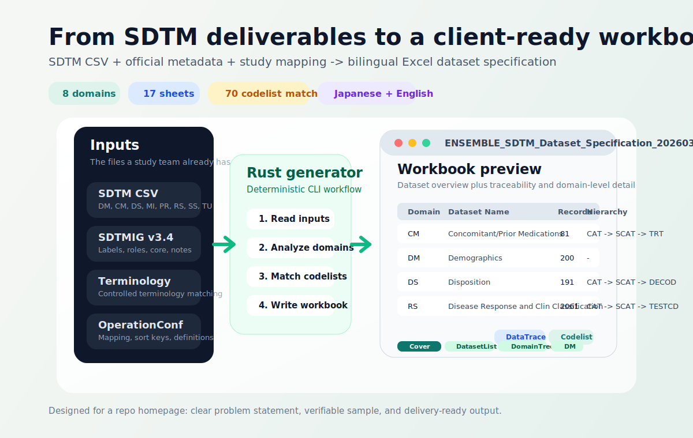

<div align="center">

# SDTM Dataset Specification Creator

**Project codename: SDTM Spec Forge**

Generate a bilingual Excel specification workbook from SDTM datasets, official CDISC metadata, and study-specific mapping rules.

Built for teams that already have SDTM deliverables, but still need a readable client-facing specification package for Japanese delivery, review, and handoff.

<p>
  <a href="#quick-demo"><strong>Quick Demo</strong></a> |
  <a href="#what-it-generates"><strong>Workbook Preview</strong></a> |
  <a href="#where-each-part-fits"><strong>Repository Map</strong></a> |
  <a href="spec-creator/README.md"><strong>CLI Details</strong></a> |
  <a href="pipeline/README.md"><strong>Pipeline Details</strong></a>
</p>

<p>
  
  
  
  
  
  <a href="#quick-demo"></a>
</p>

</div>

<p align="center">
  
</p>

## Why this project exists

Having SDTM datasets is not the same thing as having a document a client can read. In practice, Japanese-facing delivery often still needs an Excel specification workbook that explains domains, variables, codelists, and mapping rationale in a format that PMs, reviewers, and clients can browse without opening code.

This repository fills that gap. It takes the SDTM assets you already have, combines them with SDTMIG and Terminology metadata plus study-specific `OperationConf.xlsx` mappings, then generates a workbook that is much closer to a delivery document than a raw dataset folder.

It is not trying to replace Pinnacle 21 or formal CDISC validation. It is a practical bridge between standardized data and a client-facing specification package.

## Core idea

| Input | Engine | Output |
| --- | --- | --- |
| `SDTM CSV` files, `SDTMIG v3.4`, `SDTM Terminology`, and `<STUDY_ID>_OperationConf.xlsx` | A Rust CLI that reads metadata, analyzes domain structure, matches codelists, and writes Excel sheets | A multi-tab workbook for delivery, review, QA, and study handoff |

## What it generates

Using the included `ENSEMBLE` sample configuration, the current generator successfully produces a workbook with:

- 8 SDTM domains loaded from CSV
- 17 sheets in the final Excel file
- dataset overview, domain trees, mapping trace, per-domain variable lists, codelist matching, and notes
- bilingual content: official SDTM metadata in English, operational annotations in Japanese where available

### Workbook sections

| Sheet group | Purpose |
| --- | --- |
| `Cover` / `Overview` / `ChangeHistory` | Document identity, navigation, and revision history |
| `DatasetList` | Domain-level summary with structure, sort key, record count, and hierarchy |
| `DomainTree` / `DomainTable` | Human-readable classification breakdown such as `CAT -> SCAT -> TRT` |
| `DataTrace` | Trace from EDC and mapping definitions to SDTM variables |
| `CM`, `DM`, `DS`, ... | Per-domain variable metadata sheets |
| `Codelist` | Controlled terminology matches found from actual data values |
| `Notes` | Manual notes and handoff-ready commentary |

## Quick demo

Because the output is an Excel workbook built from local study files, the fastest way to evaluate the project is to run the included sample locally.

```powershell
git clone https://github.com/hakupao/sdtm-spec-forge.git
cd sdtm-spec-forge\spec-creator
cargo run --release -- --config ..\config.toml
```

Generated file:

```text
output\ENSEMBLE_SDTM_Dataset_Specification_<YYYYMMDD>.xlsx
```

The sample config already points to repository-included paths:

- `./SDTM_Data_Set`
- `./SDTM_Master/SDTMIG_v3.4.xlsx`
- `./SDTM_Master/SDTM Terminology.xlsx`
- `./SDTM_Data_Set/ENSEMBLE_OperationConf.xlsx`
- `./output`

## Best-fit use cases

- Preparing Japanese client delivery documents from already standardized SDTM datasets
- Turning a raw SDTM folder into something PMs, reviewers, and clients can browse in Excel
- Creating a repeatable spec-generation workflow instead of manually maintaining many workbook tabs
- Bridging internal programming output and external-facing documentation during study handoff

## Where each part fits

This repository contains two related but distinct layers:

| Path | Role |
| --- | --- |
| [`spec-creator/`](spec-creator/) | Main product. Rust CLI that converts SDTM deliverables into an Excel specification workbook |
| [`pipeline/`](pipeline/) | Upstream Python pipeline that can transform raw clinical data into SDTM datasets and M5-style packages |
| [`docs/requirements/`](docs/requirements/) | Project notes, requirements, and background context |
| [`config.toml`](config.toml) | Ready-to-run sample configuration for the spec generator |

If you only want to evaluate the specification generator, start with `spec-creator/`. The Python pipeline is useful when this repository is used as a fuller end-to-end workflow.

## Tech stack

- Rust 2021
- `clap` for CLI handling
- `calamine` for Excel input parsing
- `rust_xlsxwriter` for Excel generation
- Python pipeline modules for upstream SDTM processing
- CDISC SDTMIG v3.4 metadata and terminology sources

## Current scope

- Targets `SDTMIG v3.4`
- Assumes SDTM CSV datasets already exist
- Uses `OperationConf.xlsx` as study-specific mapping input
- Generates Excel output, not a web UI
- Focuses on documentation generation rather than standards validation

## Related docs

- [Spec creator usage guide](spec-creator/README.md)
- [Pipeline architecture guide](pipeline/README.md)
- [Project overview notes](docs/requirements/00_project_overview.md)

## License

MIT. See [LICENSE](LICENSE).
