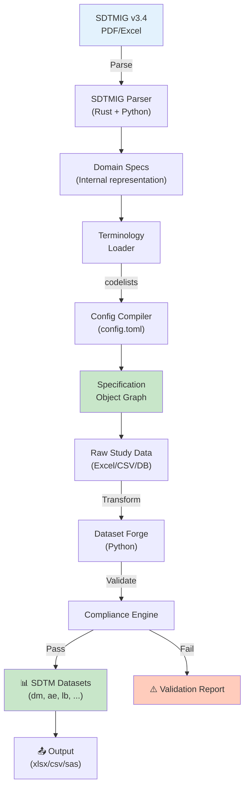

[English](README.md) | [中文](README_CN.md)

<div align="center">

```svg
<svg viewBox="0 0 800 120" xmlns="http://www.w3.org/2000/svg">
  <defs>
    <linearGradient id="grad3" x1="0%" y1="0%" x2="100%" y2="0%">
      <stop offset="0%" style="stop-color:#4facfe;stop-opacity:1" />
      <stop offset="100%" style="stop-color:#00f2fe;stop-opacity:1" />
    </linearGradient>
  </defs>
  <rect width="800" height="120" fill="url(#grad3)" rx="10"/>
  <text x="400" y="70" font-size="48" font-weight="bold" fill="white" text-anchor="middle" font-family="monospace">
    SDTM Spec Forge
  </text>
  <text x="400" y="105" font-size="16" fill="#f0f0f0" text-anchor="middle" font-family="sans-serif">
    SDTMIG Specification Compiler • Dataset Forge • Python + Rust
  </text>
</svg>
```


**End-to-end SDTM specification and dataset forge — compile SDTMIG references into config-driven pipelines for formatted SDTM dataset creation.**

[Features](#features) • [Architecture](#architecture) • [Quick Start](#quick-start) • [Usage](#usage) • [Components](#components)

</div>

---

## Overview

SDTM Spec Forge is a next-generation tool for specification-driven SDTM dataset creation. It combines Python's data processing flexibility with Rust's performance to compile SDTMIG PDF/Excel master references into specification objects, then uses those specs to drive a powerful config-based pipeline.

**Key Innovation:**
- 📄 **Spec Compilation**: Extract SDTMIG v3.4 standards from PDF/Excel sources
- 🔗 **Terminology Integration**: Automatic SDTM Terminology (codelist) mapping
- ⚡ **Hybrid Architecture**: Python (high-level logic) + Rust (performance-critical parsing)
- 🎯 **Config-Driven**: toml-based specification and pipeline configuration
- 📊 **Dataset Forge**: Turn specs into production-grade SDTM datasets
- 🔄 **Full Traceability**: From source specification to formatted output

---

## Key Features

| Feature | Description |
|---------|-------------|
| 📋 **SDTMIG Parser** | Extract variable definitions, domains, relationships from SDTMIG PDFs/Excel |
| 🔍 **Specification Compiler** | Build internal representation of SDTM domain structures |
| 🗂️ **Terminology Manager** | Map SDTM Terminology codelists to study data |
| 🔧 **Config DSL** | toml-based specification configuration for customization |
| 📦 **Dataset Generation** | Forge SDTM-compliant datasets from raw study data |
| ✅ **Compliance Validation** | CDISC rule validation and audit reporting |
| 🚀 **High Performance** | Rust-accelerated parsing for large specifications |
| 📈 **Extensible Design** | Plugin architecture for domain-specific extensions |

---

## Architecture



### Component Overview

#### Python: High-Level Pipeline (pipeline/)
- Configuration loading and validation
- Data transformation orchestration
- Dataset generation and export
- Audit trail logging

#### Rust: Performance-Critical Parsing (spec-creator/)
- SDTMIG PDF/Excel parsing
- Specification compilation
- Domain relationship resolution
- Terminology index building

---

## Project Structure

```
sdtm-spec-forge/
├── 📄 README.md & README_CN.md
├── 📄 LICENSE                  # Open source license
├── 📄 config.toml              # Global configuration
├── 📄 Cargo.toml               # Rust workspace
├── 📄 pyproject.toml           # Python project config
│
├── 🐍 pipeline/ (Python)
│   ├── main.py                 # Entry point
│   ├── config.py               # Config loader
│   ├── dataset_forger.py       # Main dataset creation
│   ├── terminology_manager.py  # Codelist mapping
│   ├── validator.py            # CDISC compliance
│   ├── exporter.py             # Multi-format output
│   └── audit.py                # Audit trail logging
│
├── 🦀 spec-creator/ (Rust)
│   ├── Cargo.toml
│   ├── src/
│   │   ├── lib.rs              # Library root
│   │   ├── parser.rs           # SDTMIG parsing logic
│   │   ├── spec.rs             # Specification objects
│   │   ├── terminology.rs      # Terminology handling
│   │   └── codelist.rs         # Codelist compilation
│   └── tests/
│       └── integration_tests.rs
│
├── 📚 docs/
│   ├── ARCHITECTURE.md
│   ├── SPEC_COMPILATION.md
│   ├── CONFIG_REFERENCE.md
│   ├── PYTHON_API.md
│   └── RUST_GUIDE.md
│
├── 📊 specs/
│   ├── sdtmig_v3.4/
│   │   ├── sdtmig.pdf          # Master reference
│   │   ├── sdtm_terminology.xlsx
│   │   └── compiled.json       # Pre-compiled specs
│   └── custom/
│       └── extensions.toml
│
└── ✅ tests/
    ├── test_python_integration.py
    └── rust_tests/
```

---

## Quick Start

### Prerequisites

- **Python 3.11+**
- **Rust 1.70+** (with Cargo)
- **libpdf** development headers

### Installation

```bash
# Clone repository
git clone https://github.com/hakupao/sdtm-spec-forge.git
cd sdtm-spec-forge

# Build Rust component
cd spec-creator
cargo build --release
cd ..

# Install Python dependencies
pip install -e .

# Verify installation
python -c "import pipeline; print('✓ Ready to forge!')"
```

### 10-Minute First Forge

```bash
# 1. Prepare study data
cp /path/to/study_export.xlsx data/raw/

# 2. Configure specification (config.toml already set)
# Edit config.toml for your study requirements

# 3. Run specification compiler
python -m pipeline.spec_compiler \
    --sdtmig specs/sdtmig_v3.4/sdtmig.pdf \
    --output specs/compiled.json

# 4. Run dataset forge
python -m pipeline.dataset_forger \
    --spec specs/compiled.json \
    --data data/raw/study_export.xlsx \
    --output data/sdtm/

# 5. Review SDTM datasets
ls data/sdtm/
# dm.xlsx, ae.xlsx, lb.xlsx, ...
```

---

## Configuration

### config.toml (Global Settings)

```toml
[specification]
sdtmig_version = "3.4"
sdtm_terminology = "2024-01"
validation_mode = "strict"  # strict, lenient, report_only

[pipeline]
log_level = "INFO"
enable_caching = true
cache_dir = "./cache/"
parallel_processing = 4

[output]
format = "xlsx"             # xlsx, csv, sas, parquet
include_audit_trail = true
sdtm_subset = false         # Include all domains or subset

[terminology]
codelists_path = "specs/sdtmig_v3.4/sdtm_terminology.xlsx"
auto_mapping = true
unmapped_strategy = "report"  # report, skip, fail

[compliance]
check_required_variables = true
check_domain_relationships = true
check_data_types = true
halt_on_error = false
```

### Specification File Format (specs/compiled.json)

```json
{
  "sdtmig_version": "3.4",
  "domains": {
    "DM": {
      "description": "Demographics",
      "domain_class": "SPECIAL PURPOSE",
      "variables": [
        {
          "name": "USUBJID",
          "type": "text",
          "length": 12,
          "required": true,
          "definition": "Unique Subject Identifier"
        }
      ]
    }
  },
  "terminology": {
    "SEX": ["M", "F"],
    "RACE": ["AMERICAN INDIAN OR ALASKA NATIVE", ...]
  }
}
```

---

## Usage

### Python API

#### Basic Dataset Generation

```python
from pipeline.config import load_config
from pipeline.dataset_forger import DatasetForger
from pipeline.terminology_manager import TerminologyManager

# Load specification
config = load_config("config.toml")
terminology = TerminologyManager.from_config(config)
forger = DatasetForger(config, terminology)

# Load and transform data
raw_data = load_raw_data("data/raw/study_export.xlsx")
sdtm_datasets = forger.forge(raw_data)

# Validate and export
validator = Validator(config)
report = validator.validate_all(sdtm_datasets)

if report.is_valid:
    exporter = Exporter(config)
    exporter.export_all(sdtm_datasets, "data/sdtm/")
    print(f"✓ {len(sdtm_datasets)} domains created")
```

#### Custom Domain Logic

```python
from pipeline.dataset_forger import DomainForger

class CustomAEForger(DomainForger):
    def forge_ae(self, raw_data, spec):
        df = super().forge_ae(raw_data, spec)

        # Add study-specific AE logic
        df['AETOXGR'] = df['AESEV'].apply(
            lambda x: self.map_severity_to_toxgr(x)
        )

        return df

forger = DatasetForger(config, terminology)
forger.ae_forger = CustomAEForger()
sdtm_datasets = forger.forge(raw_data)
```

#### Spec Compilation

```python
from pipeline.spec_compiler import SpecCompiler

compiler = SpecCompiler()

# Compile from SDTMIG PDF
spec = compiler.compile_from_pdf(
    "specs/sdtmig_v3.4/sdtmig.pdf"
)

# Enhance with custom definitions
spec.add_extension("specs/custom/extensions.toml")

# Save compiled specification
spec.save("specs/compiled.json")
```

### Command-Line Interface

```bash
# Compile SDTMIG specification
python -m pipeline.spec_compiler \
    --sdtmig specs/sdtmig_v3.4/sdtmig.pdf \
    --terminology specs/sdtmig_v3.4/sdtm_terminology.xlsx \
    --output specs/compiled.json

# Forge SDTM datasets
python -m pipeline.dataset_forger \
    --spec specs/compiled.json \
    --config config.toml \
    --input data/raw/ \
    --output data/sdtm/ \
    --format xlsx \
    --validate

# Generate compliance report
python -m pipeline.validator \
    --spec specs/compiled.json \
    --datasets data/sdtm/ \
    --output validation_report.html
```

---

## Rust API (spec-creator)

### Building Specs

```rust
use spec_creator::parser::SDTMIGParser;
use spec_creator::spec::SpecificationBuilder;

fn main() -> Result<(), Box<dyn std::error::Error>> {
    // Parse SDTMIG PDF
    let parser = SDTMIGParser::new();
    let domains = parser.parse_pdf("sdtmig.pdf")?;

    // Build specification
    let spec = SpecificationBuilder::new("3.4")
        .add_domains(domains)
        .with_terminology("sdtm_terminology.xlsx")?
        .build()?;

    // Serialize
    spec.to_json_file("compiled.json")?;

    Ok(())
}
```

### Terminology Handling

```rust
use spec_creator::terminology::TerminologyIndex;

let mut terminology = TerminologyIndex::new();
terminology.load_codelists("sdtm_terminology.xlsx")?;

// Look up codelist values
let sex_values = terminology.get_codelist("SEX")?;
println!("SEX codelist: {:?}", sex_values);
```

---

## Features in Detail

<details>
<summary><b>📋 SDTMIG Specification Compilation</b></summary>

The spec compiler extracts:

- **Domain definitions**: Classes, purposes, relationships
- **Variable specifications**: Names, types, lengths, formats
- **Required/Expected variables**: Validation rules
- **Relationships**: Domain inter-dependencies
- **Terminology**: Codelists and SDTM Terminology mappings

Output is a searchable JSON representation used throughout the pipeline.

</details>

<details>
<summary><b>🔗 Terminology & Codelist Mapping</b></summary>

Automatic mapping of study data to SDTM Terminology:

```python
# Study data: Sex = "Male"
# SDTM Terminology: SEX codelist has "M"
# Automatic mapping: "Male" → "M"

terminology = TerminologyManager.from_config(config)
sdtm_value = terminology.map("SEX", "Male")
# Result: "M"
```

Supports custom mappings via extension files.

</details>

<details>
<summary><b>⚡ Performance Optimizations</b></summary>

- **Lazy loading**: Specifications loaded on-demand
- **Caching**: Compiled specs cached for reuse
- **Parallel processing**: Multi-threaded domain forging
- **Rust acceleration**: PDF parsing in Rust (100x faster)

</details>

<details>
<summary><b>🎯 Validation & Compliance</b></summary>

Built-in validation for:

- CDISC domain and variable requirements
- Data type compatibility
- Required field presence
- Value range constraints
- Relationship integrity
- Terminology mapping accuracy

</details>

---

## Dependencies

### Python

```
pydantic>=2.0           # Config & spec validation
pandas>=2.0             # Data manipulation
openpyxl>=3.0          # Excel I/O
pyyaml>=6.0            # YAML parsing
requests>=2.25         # HTTP (terminology downloads)
```

### Rust

```toml
[dependencies]
pdfium-render = "0.8"   # PDF parsing
serde = { version = "1.0", features = ["derive"] }
serde_json = "1.0"
```

---

## Project Layout

```
Pipeline Architecture:
Raw Data → Specification Compilation → Config Loading →
  ↓
Dataset Forging (per-domain):
  - Field mapping
  - Value transformation
  - Terminology application
  ↓
Validation:
  - CDISC compliance
  - Data quality
  - Audit requirements
  ↓
Export:
  - XLSX/CSV/SAS/Parquet
  - Audit reports
  - Validation summaries
```

---

## Contributing

Contributions welcome! Please see [CONTRIBUTING.md](CONTRIBUTING.md).

```bash
# Development setup
git clone https://github.com/hakupao/sdtm-spec-forge.git
cd sdtm-spec-forge

# Python development
pip install -e ".[dev]"
pytest tests/

# Rust development
cd spec-creator
cargo test
```

---

## Roadmap

- [ ] Interactive Spec Editor UI
- [ ] Incremental spec compilation
- [ ] Direct SDTMIG.xlsx support (not just PDF)
- [ ] Real-time validation feedback
- [ ] Cloud deployment templates
- [ ] SDTM 1.5+ support roadmap

---

## License

This project is open source. See [LICENSE](LICENSE) for details.

---

## Citation

```bibtex
@software{sdtmspecforge2024,
  author = {hakupao},
  title = {SDTM Spec Forge: End-to-End Specification Compilation and Dataset Forging},
  url = {https://github.com/hakupao/sdtm-spec-forge},
  year = {2024}
}
```

---

## Support

- 📧 **Issues**: [GitHub Issues](https://github.com/hakupao/sdtm-spec-forge/issues)
- 💬 **Discussions**: [GitHub Discussions](https://github.com/hakupao/sdtm-spec-forge/discussions)
- 📖 **Documentation**: [docs/](docs/)

---

<div align="center">

**[⬆ Back to Top](#-sdtm-spec-forge)**

Forged with precision for CDISC standardization

</div>
