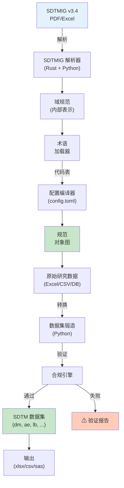

[English](README.md) | [中文](README_CN.md)

<div align="center">


**端到端的 SDTM 规范和数据集锻造 — 将 SDTMIG 参考编译为配置驱动管道，用于生成格式化的 SDTM 数据集。**

[功能](#功能) • [架构](#架构) • [快速开始](#快速开始) • [使用](#使用) • [组件](#组件)

</div>

---


### 预览

<div align="center">
  
</div>

## 项目概述

SDTM Spec Forge 是一套用于规范驱动的 SDTM 数据集创建的新一代工具。它结合了 Python 的数据处理灵活性和 Rust 的性能优势，将 SDTMIG PDF/Excel 主参考编译成规范对象，然后使用这些规范驱动一套强大的基于配置的管道。

**关键创新：**
- 📄 **规范编译**：从 PDF/Excel 源提取 SDTMIG v3.4 标准
- 🔗 **术语集成**：自动 SDTM Terminology（代码表）映射
- ⚡ **混合架构**：Python（高级逻辑）+ Rust（性能关键解析）
- 🎯 **配置驱动**：基于 toml 的规范和管道配置
- 📊 **数据集锻造**：将规范转换为生产级 SDTM 数据集
- 🔄 **完整可追踪性**：从源规范到格式化输出

---

## 关键功能

| 功能 | 说明 |
|------|------|
| 📋 **SDTMIG 解析器** | 从 SDTMIG PDF/Excel 提取变量定义、域、关系 |
| 🔍 **规范编译器** | 构建 SDTM 域结构的内部表示 |
| 🗂️ **术语管理器** | 将 SDTM Terminology 代码表映射到研究数据 |
| 🔧 **配置 DSL** | 基于 toml 的规范配置用于自定义 |
| 📦 **数据集生成** | 从原始研究数据锻造 SDTM 兼容数据集 |
| ✅ **合规验证** | CDISC 规则验证和审计报告 |
| 🚀 **高性能** | Rust 加速的大规范解析 |
| 📈 **可扩展设计** | 用于域特定扩展的插件架构 |

---

## 架构设计



### 组件概览

#### Python：高级管道 (pipeline/)
- 配置加载和验证
- 数据转换编排
- 数据集生成和导出
- 审计追踪日志

#### Rust：性能关键解析 (spec-creator/)
- SDTMIG PDF/Excel 解析
- 规范编译
- 域关系解析
- 术语索引构建

---

## 项目结构

```
sdtm-spec-forge/
├── 📄 README.md & README_CN.md
├── 📄 LICENSE                  # 开源许可证
├── 📄 config.toml              # 全局配置
├── 📄 Cargo.toml               # Rust 工作空间
├── 📄 pyproject.toml           # Python 项目配置
│
├── 🐍 pipeline/ (Python)
│   ├── main.py                 # 入口点
│   ├── config.py               # 配置加载器
│   ├── dataset_forger.py       # 主数据集创建
│   ├── terminology_manager.py  # 代码表映射
│   ├── validator.py            # CDISC 合规
│   ├── exporter.py             # 多格式输出
│   └── audit.py                # 审计追踪日志
│
├── 🦀 spec-creator/ (Rust)
│   ├── Cargo.toml
│   ├── src/
│   │   ├── lib.rs              # 库根
│   │   ├── parser.rs           # SDTMIG 解析逻辑
│   │   ├── spec.rs             # 规范对象
│   │   ├── terminology.rs      # 术语处理
│   │   └── codelist.rs         # 代码表编译
│   └── tests/
│       └── integration_tests.rs
│
├── 📚 docs/
│   ├── ARCHITECTURE.md
│   ├── SPEC_COMPILATION.md
│   ├── CONFIG_REFERENCE.md
│   ├── PYTHON_API.md
│   └── RUST_GUIDE.md
│
├── 📊 specs/
│   ├── sdtmig_v3.4/
│   │   ├── sdtmig.pdf          # 主参考文件
│   │   ├── sdtm_terminology.xlsx
│   │   └── compiled.json       # 预编译规范
│   └── custom/
│       └── extensions.toml
│
└── ✅ tests/
    ├── test_python_integration.py
    └── rust_tests/
```

---

## 快速开始

### 前置条件

- **Python 3.11+**
- **Rust 1.70+**（含 Cargo）
- **libpdf** 开发头文件

### 安装

```bash
# 克隆代码库
git clone https://github.com/hakupao/sdtm-spec-forge.git
cd sdtm-spec-forge

# 构建 Rust 组件
cd spec-creator
cargo build --release
cd ..

# 安装 Python 依赖
pip install -e .

# 验证安装
python -c "import pipeline; print('✓ 准备好锻造！')"
```

### 10 分钟首次锻造

```bash
# 1. 准备研究数据
cp /path/to/study_export.xlsx data/raw/

# 2. 配置规范（config.toml 已设置）
# 编辑 config.toml 以满足你的研究需求

# 3. 运行规范编译器
python -m pipeline.spec_compiler \
    --sdtmig specs/sdtmig_v3.4/sdtmig.pdf \
    --output specs/compiled.json

# 4. 运行数据集锻造
python -m pipeline.dataset_forger \
    --spec specs/compiled.json \
    --data data/raw/study_export.xlsx \
    --output data/sdtm/

# 5. 查看 SDTM 数据集
ls data/sdtm/
# dm.xlsx, ae.xlsx, lb.xlsx, ...
```

---

## 配置

### config.toml（全局设置）

```toml
[specification]
sdtmig_version = "3.4"
sdtm_terminology = "2024-01"
validation_mode = "strict"  # strict, lenient, report_only

[pipeline]
log_level = "INFO"
enable_caching = true
cache_dir = "./cache/"
parallel_processing = 4

[output]
format = "xlsx"             # xlsx, csv, sas, parquet
include_audit_trail = true
sdtm_subset = false         # 包含所有域或子集

[terminology]
codelists_path = "specs/sdtmig_v3.4/sdtm_terminology.xlsx"
auto_mapping = true
unmapped_strategy = "report"  # report, skip, fail

[compliance]
check_required_variables = true
check_domain_relationships = true
check_data_types = true
halt_on_error = false
```

### 规范文件格式 (specs/compiled.json)

```json
{
  "sdtmig_version": "3.4",
  "domains": {
    "DM": {
      "description": "人口统计学",
      "domain_class": "特殊用途",
      "variables": [
        {
          "name": "USUBJID",
          "type": "文本",
          "length": 12,
          "required": true,
          "definition": "受试者唯一标识符"
        }
      ]
    }
  },
  "terminology": {
    "SEX": ["M", "F"],
    "RACE": ["美洲印第安人或阿拉斯加原住民", ...]
  }
}
```

---

## 使用

### Python API

#### 基础数据集生成

```python
from pipeline.config import load_config
from pipeline.dataset_forger import DatasetForger
from pipeline.terminology_manager import TerminologyManager

# 加载规范
config = load_config("config.toml")
terminology = TerminologyManager.from_config(config)
forger = DatasetForger(config, terminology)

# 加载和转换数据
raw_data = load_raw_data("data/raw/study_export.xlsx")
sdtm_datasets = forger.forge(raw_data)

# 验证和导出
validator = Validator(config)
report = validator.validate_all(sdtm_datasets)

if report.is_valid:
    exporter = Exporter(config)
    exporter.export_all(sdtm_datasets, "data/sdtm/")
    print(f"✓ 已创建 {len(sdtm_datasets)} 个域")
```

#### 自定义域逻辑

```python
from pipeline.dataset_forger import DomainForger

class CustomAEForger(DomainForger):
    def forge_ae(self, raw_data, spec):
        df = super().forge_ae(raw_data, spec)

        # 添加研究特定的 AE 逻辑
        df['AETOXGR'] = df['AESEV'].apply(
            lambda x: self.map_severity_to_toxgr(x)
        )

        return df

forger = DatasetForger(config, terminology)
forger.ae_forger = CustomAEForger()
sdtm_datasets = forger.forge(raw_data)
```

#### 规范编译

```python
from pipeline.spec_compiler import SpecCompiler

compiler = SpecCompiler()

# 从 SDTMIG PDF 编译
spec = compiler.compile_from_pdf(
    "specs/sdtmig_v3.4/sdtmig.pdf"
)

# 用自定义定义增强
spec.add_extension("specs/custom/extensions.toml")

# 保存编译的规范
spec.save("specs/compiled.json")
```

### 命令行界面

```bash
# 编译 SDTMIG 规范
python -m pipeline.spec_compiler \
    --sdtmig specs/sdtmig_v3.4/sdtmig.pdf \
    --terminology specs/sdtmig_v3.4/sdtm_terminology.xlsx \
    --output specs/compiled.json

# 锻造 SDTM 数据集
python -m pipeline.dataset_forger \
    --spec specs/compiled.json \
    --config config.toml \
    --input data/raw/ \
    --output data/sdtm/ \
    --format xlsx \
    --validate

# 生成合规报告
python -m pipeline.validator \
    --spec specs/compiled.json \
    --datasets data/sdtm/ \
    --output validation_report.html
```

---

## Rust API (spec-creator)

### 构建规范

```rust
use spec_creator::parser::SDTMIGParser;
use spec_creator::spec::SpecificationBuilder;

fn main() -> Result<(), Box<dyn std::error::Error>> {
    // 解析 SDTMIG PDF
    let parser = SDTMIGParser::new();
    let domains = parser.parse_pdf("sdtmig.pdf")?;

    // 构建规范
    let spec = SpecificationBuilder::new("3.4")
        .add_domains(domains)
        .with_terminology("sdtm_terminology.xlsx")?
        .build()?;

    // 序列化
    spec.to_json_file("compiled.json")?;

    Ok(())
}
```

### 术语处理

```rust
use spec_creator::terminology::TerminologyIndex;

let mut terminology = TerminologyIndex::new();
terminology.load_codelists("sdtm_terminology.xlsx")?;

// 查询代码表值
let sex_values = terminology.get_codelist("SEX")?;
println!("SEX 代码表: {:?}", sex_values);
```

---

## 功能详解

<details>
<summary><b>📋 SDTMIG 规范编译</b></summary>

规范编译器提取：

- **域定义**：类、用途、关系
- **变量规范**：名称、类型、长度、格式
- **必需/预期变量**：验证规则
- **关系**：域间依赖关系
- **术语**：代码表和 SDTM Terminology 映射

输出是整个管道使用的可搜索 JSON 表示。

</details>

<details>
<summary><b>🔗 术语和代码表映射</b></summary>

自动将研究数据映射到 SDTM Terminology：

```python
# 研究数据：Sex = "Male"
# SDTM Terminology：SEX 代码表有 "M"
# 自动映射：" Male" → "M"

terminology = TerminologyManager.from_config(config)
sdtm_value = terminology.map("SEX", "Male")
# 结果："M"
```

支持通过扩展文件的自定义映射。

</details>

<details>
<summary><b>⚡ 性能优化</b></summary>

- **延迟加载**：按需加载规范
- **缓存**：编译的规范被缓存供重用
- **并行处理**：多线程域锻造
- **Rust 加速**：Rust 中的 PDF 解析（快 100 倍）

</details>

<details>
<summary><b>🎯 验证和合规</b></summary>

内置验证：

- CDISC 域和变量需求
- 数据类型兼容性
- 必需字段存在性
- 值范围约束
- 关系完整性
- 术语映射精确性

</details>

---

## 依赖包

### Python

```
pydantic>=2.0           # 配置和规范验证
pandas>=2.0             # 数据操作
openpyxl>=3.0          # Excel I/O
pyyaml>=6.0            # YAML 解析
requests>=2.25         # HTTP（术语下载）
```

### Rust

```toml
[dependencies]
pdfium-render = "0.8"   # PDF 解析
serde = { version = "1.0", features = ["derive"] }
serde_json = "1.0"
```

---

## 项目布局

```
管道架构：
原始数据 → 规范编译 → 配置加载 →
  ↓
数据集锻造（每个域）：
  - 字段映射
  - 值转换
  - 术语应用
  ↓
验证：
  - CDISC 合规
  - 数据质量
  - 审计需求
  ↓
导出：
  - XLSX/CSV/SAS/Parquet
  - 审计报告
  - 验证摘要
```

---

## 贡献

欢迎贡献！请参阅 [CONTRIBUTING.md](CONTRIBUTING.md)。

```bash
# 开发设置
git clone https://github.com/hakupao/sdtm-spec-forge.git
cd sdtm-spec-forge

# Python 开发
pip install -e ".[dev]"
pytest tests/

# Rust 开发
cd spec-creator
cargo test
```

---

## 路线图

- [ ] 交互式规范编辑器 UI
- [ ] 增量规范编译
- [ ] 直接 SDTMIG.xlsx 支持（不仅仅是 PDF）
- [ ] 实时验证反馈
- [ ] 云部署模板
- [ ] SDTM 1.5+ 支持路线图

---

## 许可证

本项目是开源的。详见 [LICENSE](LICENSE)。

---

## 引用

```bibtex
@software{sdtmspecforge2024,
  author = {hakupao},
  title = {SDTM Spec Forge: End-to-End Specification Compilation and Dataset Forging},
  url = {https://github.com/hakupao/sdtm-spec-forge},
  year = {2024}
}
```

---

## 支持

- 📧 **问题**：[GitHub Issues](https://github.com/hakupao/sdtm-spec-forge/issues)
- 💬 **讨论**：[GitHub Discussions](https://github.com/hakupao/sdtm-spec-forge/discussions)
- 📖 **文档**：[docs/](docs/)

---

<div align="center">

**[⬆ 返回顶部](#-sdtm-spec-forge)**

为 CDISC 标准化精心锻造

</div>
